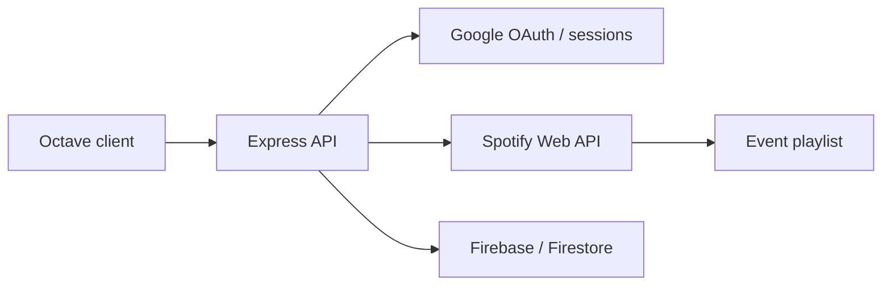

# Octave Monolith

<div align="center">


The server-side monolith for Octave, an event music experience with Spotify integration and Google sign-in.

</div>



## Features in the codebase

- Express 5 API written in TypeScript.
- Google OAuth with Passport and server-side sessions.
- Spotify authorization, token refresh, track search, and playlist operations.
- Firebase Admin/Firestore integration.
- Seed script and build/start commands for deployment.

## Setup

```bash
cd backend
npm install
```

Create `backend/.env` with the credentials used by your deployment. The code and project notes reference:

```dotenv
PORT=3000
SESSION_SECRET=replace-me
GOOGLE_CLIENT_ID=
GOOGLE_CLIENT_SECRET=
SPOTIFY_CLIENT_ID=
SPOTIFY_CLIENT_SECRET=
REDIRECT_URI=http://localhost:3000/callback
```

Firebase configuration is also required by `backend/src/firebase_firestore.ts`; use environment-specific service credentials and never commit private keys.

## Run

```bash
npm run dev
```

## Build

```bash
npm run build
npm start
```

See `notes_backend.md` and `jsonOBJS.md` for historical API and data-shape notes.
